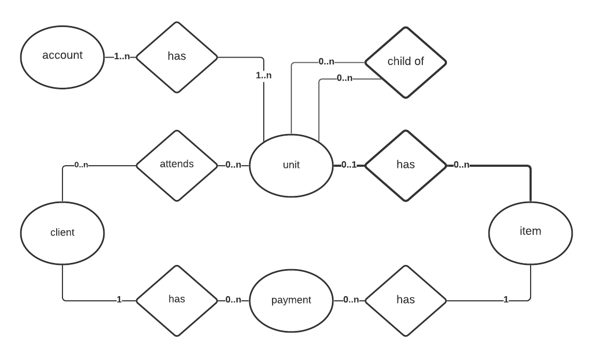

# Report no.1

Martin Stolárik\
Evidencia (športového) klubu\
8. - 14.3.2021	

## Pôvodný plán a jeho plnenie
- [x] _zapracovanie námietok k špecifikácii_\
			Žiadne neboli :)
- [x] _sprevádzkovanie navrhnutej databázy_\
			Štruktúra databázy bola pozmenená, sprevádzkovaná bola úspešne na serveroch hostingovej spoločnosti Websupport.
- [x] _vytvorenie záznamov v databáze pre fiktívny klub_\
			Záznamy boli vytvorené, spolu so štruktúrou sú súčasťou súboru [_db.sql_](db.sql).

## Odchýlky od plánu, komplikácie
* Pôvodne navrhnutá databáza bola upravená s ohľadom na požiadavku všobecnosti systému.
	* Model popísaný v šepcifikácii počítal s troj-úrovňovou hierarchiou _kurz - udalosť - výskyt udalosti_, pričom prihlasovanie používateľov bolo možné len na úrovni _udalosti_, takto je možné zvoliť politiku prihlasovania pre jednotlivé _výskyty udalosti_.
	* Reprezentácia troj-úrovňovej hierarchie _kurz - udalosť - výskyt udalosti_ bola pozmenená, nakoľko atribúty každej z úrovní sú takmer totožné a tak nie je nutné vytvárať pre každú úroveň novú tabuľku. Namiesto toho vytvárame tabuľku _unit_ a na rozlísenie úrovne zavádzame pole _type_ nadobúdajúce hodnoty _course_, _event_ alebo _occurence_. Výhodou je možnosť pridania úrovne bez nutnosti zmeny štruktúry databázy, nevýhodou nutnosť vyššej opatrnosti pri práci s databázou, keďže takto nevynucuje všetky vzťahy many-to-one (teraz napríklad možno vytvoriť záznamy, ktoré prisúdia jeden _výskyt udalosti_ viacerým _udalostiam_, aj keď možno sa nájde use-case vyžadujúci taktúto vlastnosť...).
	* nový entitno-relačný model databázy\
	
	
## Časové nároky
* cca 8h

## Plán na ďalší týždeň
* návrh html a css pre frontend